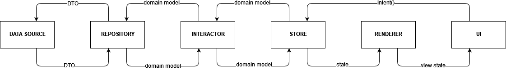

# CheatDay application

Application for putting some gamification into diet. Keep diet, do workout, get cheat day as reward.
Track your weight progress.
Traditional views with fragments, jetpack, MVI based on MVVM, backend written with ktor.
Done with intention of presenting coding
skills, my approach for app architecture, testing and having some playground to test new frameworks
and patterns.

Source code of backend for project: https://github.com/mariuszmarzec/fiteo/blob/master/src/jvmMain/kotlin/com/marzec/cheatday/CheatDay.kt

 

# Setup

1. Setup above mentioned backend locally or on some services like AWS Elastic Beanstalk
2. Before you will be able to run cheat day, declare variables in local.properties like below to
configure connection with backend and release key store

```properties
storeFile=~/key_releases/cheat_day_release.jks
keyAlias=<KEY_ALIAS>
keyPassword=<KEY_PASSWORD>
storePassword=<STORE_PASSWORD>

prod.apiUrl=http://127.0.0.1
prod.authHeader=Authorization
test.apiUrl=http://127.0.0.1/test
test.authHeader=Authorization-Test
```

3. Sync project and enjoy

# Architecture



## MVI and Store
Architecture is built upon my own implementation of MVI. More about in my other repository - 
[QuickMVI](https://github.com/mariuszmarzec/QuickMVI). Whole concept is based on `Store` class wrapped
into android view model. To fire any action everything you need is declaring intent method which 
trigger actions. Reducer and sideEffect are tied closely with fired action.

```kotlin
    fun onLoginButtonClicked() = intent<Content<User>> {
        onTrigger(isCancellableFlowTrigger = true) {
            state.ifDataAvailable {
                loginRepository.login(login, password)
                    .cancelFlowsIf { it is Content.Data }
            }
        }

        reducer {
            state.reduceContentNoChanges(resultNonNull())
        }

        emitSideEffect {
            (resultNonNull() as? Content.Data)?.let { LoginSideEffects.OnLoginSuccessful }
        }
    }
```

Builder method `intent` lets to define onTrigger as action could be called. Reducer is a method which
handle state changes in response of changing onTrigger's result. Every change of state could emit 
side effect. In case of android implementation, side effect are exposed as `sideEffects` flow from 
`ViewModel`. Stores contains state which is needed to render view, but keep data which could needed 
also during communication with business layer.

## State
`State` is a helper class to deal with three basic states: `Loading`, `Data` and `Error`. Together 
with some extensions and utils method helps to reduce repeating code, simplifying code and 
unifying UI behaviour
 
## UI States and renderers

`Renderers` are classes responsible for manipulating UI in response of changing state. They could 
map state's model into UI state model and modify views directly. They are introduce in the code to be
responsible for part of UI rather than whole screen, but it depends on how complicated is view logic 
and UI's complexity. 

# Test
## Unit Tests

Business logic, store logic and repositories are tested with unit tests. Approach used for writing
is relying on given, when, then implicit separation. Every test starts with preparing appropriate
mocks, then action is made and result is saved in variable, which will be asserted with `Truth` library.

```kotlin
    @Test
    fun onLoginButtonClicked() = runBlockingTest {
        val viewModel = viewModel(defaultState)
        val states = viewModel.test(this)

        coEvery {
            loginRepository.login(
                email = "login",
                password = "password"
            )
        } returns flowOf(Content.Loading(), Content.Data(user))

        viewModel.onLoginButtonClicked()

        states.isEqualTo(
            defaultState,
            State.Loading(defaultData),
            LoginSideEffects.OnLoginSuccessful
        )
    }
```

## Screenshot tests
Testing UI layer together with renderers and any mappers is built upon screenshot testing. To achieve
that [Shot](https://github.com/pedrovgs/Shot) is used. Screenshot to compare are saved in
[app/screenshots/stage/debug](app/screenshots/stage/debug) director.

To run recording new screenshot:
```bash
gradlew stageDebugExecuteScreenshotTests -Precord
```

To verify UI with recorded earlier screenshots:

```bash
gradlew stageDebugExecuteScreenshotTests
```

### Known issues

- Screenshot testing is broken too due to lack of support test orchestrator, 
  [issue](https://github.com/pedrovgs/Shot/issues/140), current workaround: disabling orchestrator, 
  commenting out all tests excepts screenshot ones
  
## Espresso testing with Kaspresso

Testing scenarios contained in [TESTING_SCENARIOS.md](TESTING_SCENARIOS.md) are translated into 
[Kaspresso](https://github.com/KasperskyLab/Kaspresso) based tests. They used 
[MockWebServer](https://github.com/square/okhttp/tree/master/mockwebserver) to mimic server responses.
Test orchestrator is required to clean user data before every test.

## Database's DAOs testing and migrations

Other automated tests in project are tests of room's DAOs classes and migration of database between 
versions.

## Code coverage

Code coverage in project was made with [JaCoCo Plugin](https://docs.gradle.org/current/userguide/jacoco_plugin.html).

To run generate code coverage test report:

```bash
gradlew jacocoTestReport
```

### Known issues 
Due to broken screenshot tests, code coverage is broken too.

# Data sources and cache strategy

Data are store in application in shared preferences with [Jetpack Data Store](https://developer.android.com/topic/libraries/architecture/datastore)
and in SQL Lite database using [Room](https://developer.android.com/training/data-storage/room). Loading 
data from API is done with first cache pattern. It means data are loaded always from data base. Fetched
data from API when request succeed into database. Thanks to Room and kotlin flow, on every update 
in database, new values are emitted to be presented on screen.
